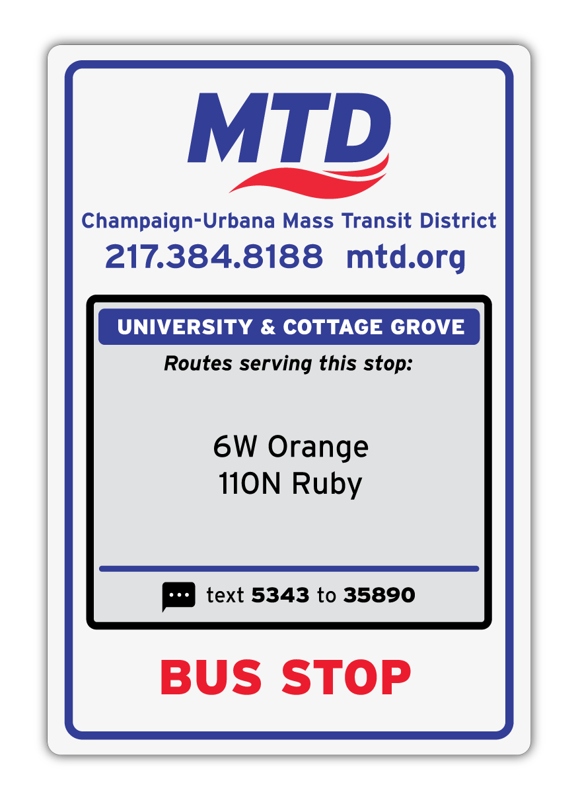

# Sign Inventory

This is an internal web app for auditing the condition of bus stop signs, shelters and amenities, for use by MTD's planning department. The app is built on top of NextJS, and communicates with a .NET EF Core API to read/write an SQL database. The application displays data points like sign condition, general notes, photos, accessibility features and more.

## Architecture Overview

The app is written in typescript upon the **NextJS app router framework**. It was bootstrapped with `create-next-app`. Application states are managed by the [**Recoil**](https://recoiljs.org/docs/introduction/motivation) library. The UI is built with a mixture of **React** and **MUI** (formerly called material UI). Authentication is handled with the **next-auth**.

This app will only function with the sign inventory API running, therefore allowing communication with the `mtdsql4` SignInventory database. More info can be found at the API's README.

## Dependencies

| Dependency            | Purpose                                         |
| --------------------- | ----------------------------------------------- |
| `@emotion/react     ` | CSS-in-JS library                               |
| `@emotion/styled    ` | CSS-in-JS library                               |
| `@mui/icons-material` | MUI icon library                                |
| `@mui/material      ` | MUI component library                           |
| `client-only        ` | NextJS component for client-only rendering      |
| `next               ` | NextJS framework                                |
| `next-auth          ` | NextJS authentication library (for Azure login) |
| `react              ` | React library                                   |
| `react-dom          ` | React library                                   |
| `recoil             ` | State management library                        |
| `server-only        ` | NextJS component for server-only rendering      |

### Development dependencies

| Dependency               | Purpose                     |
| ------------------------ | --------------------------- |
| `@types/node           ` | TypeScript type definitions |
| `@types/react          ` | TypeScript type definitions |
| `@types/react-dom      ` | TypeScript type definitions |
| `eslint                ` | Linting                     |
| `eslint-config-next    ` | Linting config for NextJS   |
| `eslint-config-prettier` | Linting config for Prettier |
| `eslint-plugin-prettier` | Linting config for Prettier |
| `husky                 ` | Git hooks                   |
| `lint-staged           ` | Git hooks                   |
| `prettier              ` | Code formatting             |
| `typescript            ` | TypeScript compiler         |

See `package.json` for the full list of dependencies and their versions.

## Environment Variables

Ensure these environment variables are set before running the app. The app will not function without them.

| Variable Name                  | Value                                                                          |
| ------------------------------ | ------------------------------------------------------------------------------ |
| `NEXT_PUBLIC_AUTOCOMPLETE_URL` | URL for the autocomplete API, version 1.0.2                                    |
| `INVENTORY_API_ENDPOINT`       | Deployment URL for the sign inventory API                                      |
| `INVENTORY_API_KEY`            | API key for the sign inventory API                                             |
| `NEXT_PUBLIC_IMAGE_DOMAIN`     | Domain for the sign inventory API images                                       |
| `NEXT_PUBLIC_IMAGE_PORT`       | Port for the sign inventory API images                                         |
| `NEXT_PUBLIC_BASE_URL`         | URL of the app's deployment                                                    |
| `AZURE_AD_CLIENT_ID`           | Client ID for Azure AD                                                         |
| `AZURE_AD_CLIENT_SECRET`       | Client secret for Azure AD                                                     |
| `AZURE_AD_TENANT_ID`           | Tenant ID for Azure AD                                                         |
| `NEXTAUTH_URL`                 | URL of the app's deployment (for AD callback)                                  |
| `SECRET`                       | Secret for NextAuth to function (can be anything, as long as they're the same) |

## Getting things running

1. Ensure all environment variables are set and the sign inventory API is running (see "Environment Variables" above)
2. `yarn install` to install all dependencies
3. `yarn dev` to start the development server (Ctrl+C to stop)
4. `yarn build` to build the app for production
5. `yarn start` to start the production server (Ctrl+C to stop)

Once the app is running, you can access it at `localhost:3000`.

## Current deployment info

Sign Inventory is currently deployed through MTD's [Vercel](vercel.com/) account. Pushes to this repo's `main` branch will trigger a new deployment.

Written by [Matthew Novelli](mailto:mnovelli@mtd.org) August 2023 🚌🚌
